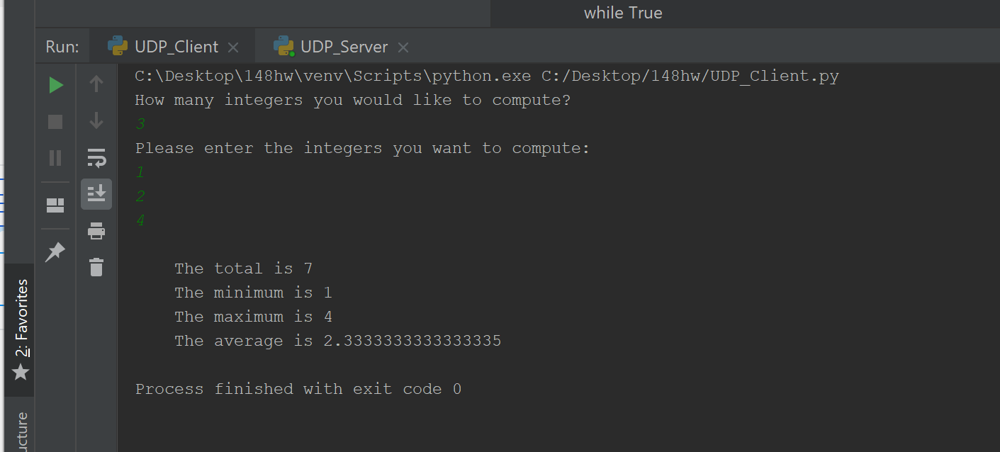
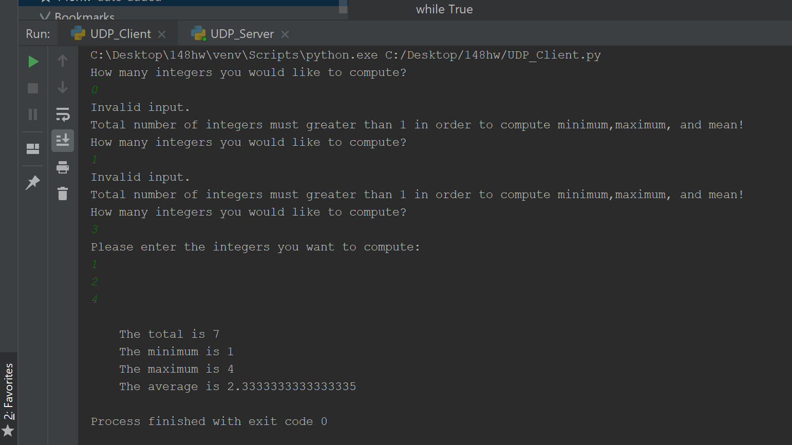
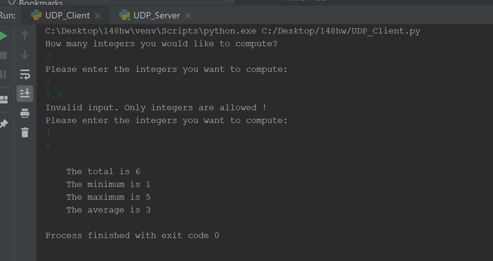
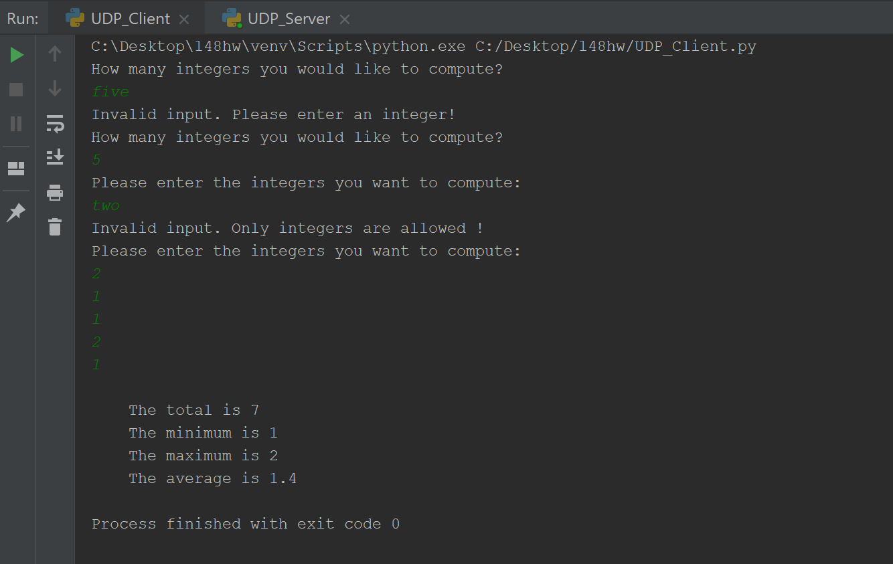
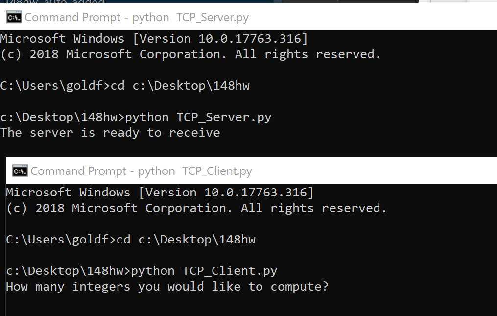
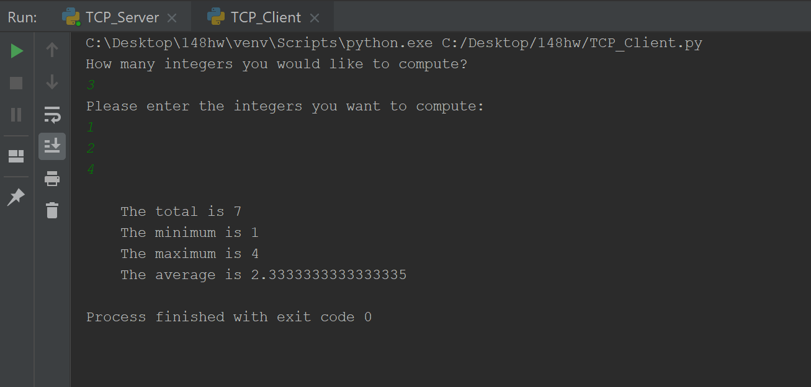
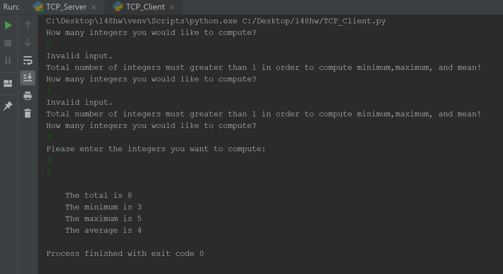
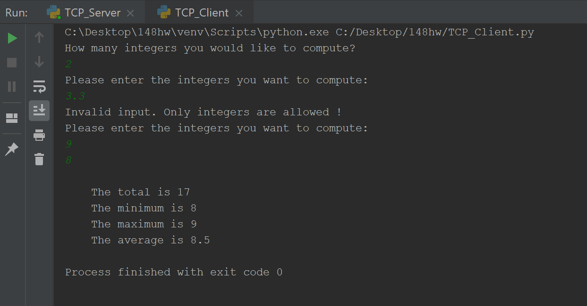
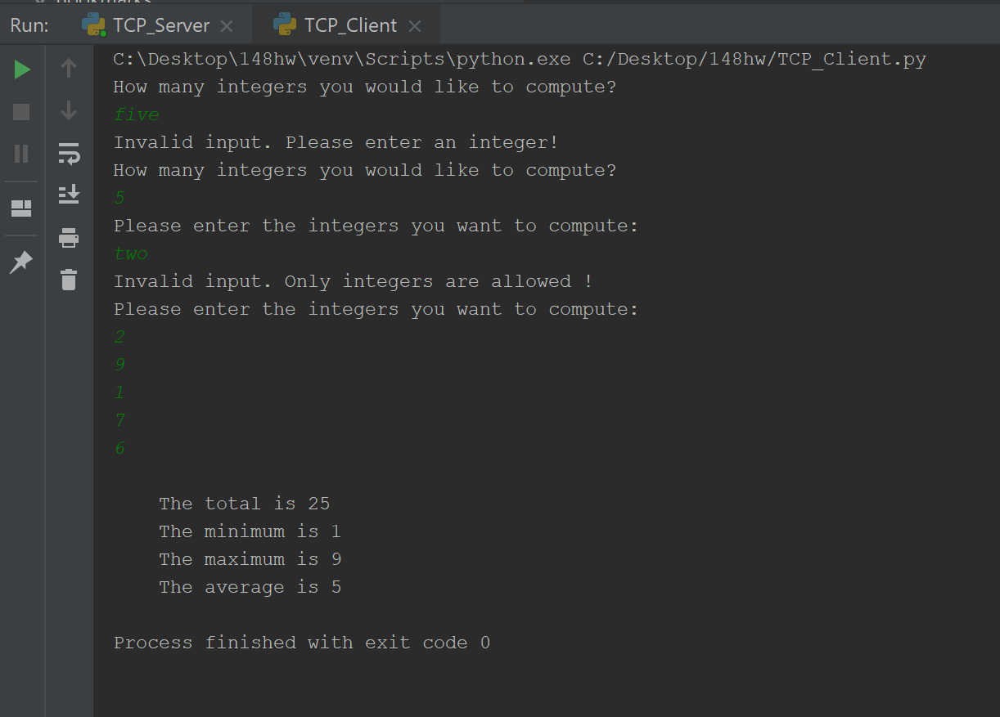

**Socket Programming**

This application performs the same task as following with UDP and TCP:

1.  The client gets a set of integers and the length of the set as command line
    arguments

2.  The client sends the set of integers to the server

3.  The server computes the total, the highest number, the lowest number, and
    the mean(in float)

4.  The server sends back the result to the client

5.  The client receives the results and prints them out.

**Instruction about How to Use UDP Socket**

There are two python scripts for the UDP socket: UDP_Server.py and UDP_Client.py

-   If your IDE allows parallel run, run UDP_Server.py and UDP_Client.py
    concurrently. The order of which script to run first doesn’t matter.

-   If your IDE doesn’t support parallel run, use bash and type the following
    command:

>   python UDP_Server.py & UDP_Client.py

**Test Case 1: (Valid inputs)**

-   Input: length of set=3, set of interger=1,2,4

-   Expect output:

>   The total is 7

>   The minimum is 1

>   The maximum is 4

>   The average is 2.3333333

**Test Case 2: (Invalid length )**

-   input: length of set=0,1

-   Expect output:

>   Keep displaying prompts to ask the user to input a valid input until getting
>   one

**Test Case 3: (Invalid numbers)**

-   Input: length of set=2, set of interger=1, 5.5

-   Expect output:

>   Keep displaying prompts to ask the user to input a valid input until getting
>   one

**Test Case 4: (Invalid input type)**

-   input: length of set=five, intergers=two

-   Expect output:

>   Keep displaying prompts to ask the user to input a valid input until getting
>   one

**Instruction about How to Use TCP Socket**

There are two python scripts for the TCP socket: TCP_Server.py and TCP_Client.py

-   If your IDE allows parallel run, run TCP_Server.py and TCP_Client.py
    concurrently.

>   NOTE: HAVE TO RUN TCP_Server.py FIRST, THEN RUN TCP_Client.py

-   If your IDE doesn’t support parallel run, use bash and type the following
    command:

>   python TCP_Server.py

>   Python TCP_Client.py

**Test Case 1: (Valid inputs)**

-   Input: length of set=3, set of interger=1,2,4

-   Expect output:

>   The total is 7

>   The minimum is 1

>   The maximum is 4

>   The average is 2.3333333

**Test Case 2: (Invalid length )**

-   input: length of set=0,1

-   Expect output:

>   Keep displaying prompts to ask the user to input a valid input until getting
>   one

**Test Case 3: (Invalid numbers)**

-   Input: length of set=2, set of interger=3.3

-   Expect output:

>   Keep displaying prompts to ask the user to input a valid input until getting
>   one

**Test Case 4: (Invalid input type)**

-   input: length of set=five, intergers=two

-   Expect output:

>   Keep displaying prompts to ask the user to input a valid input until getting
>   one

